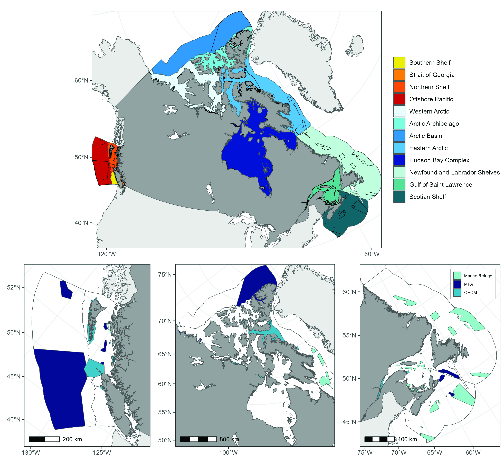
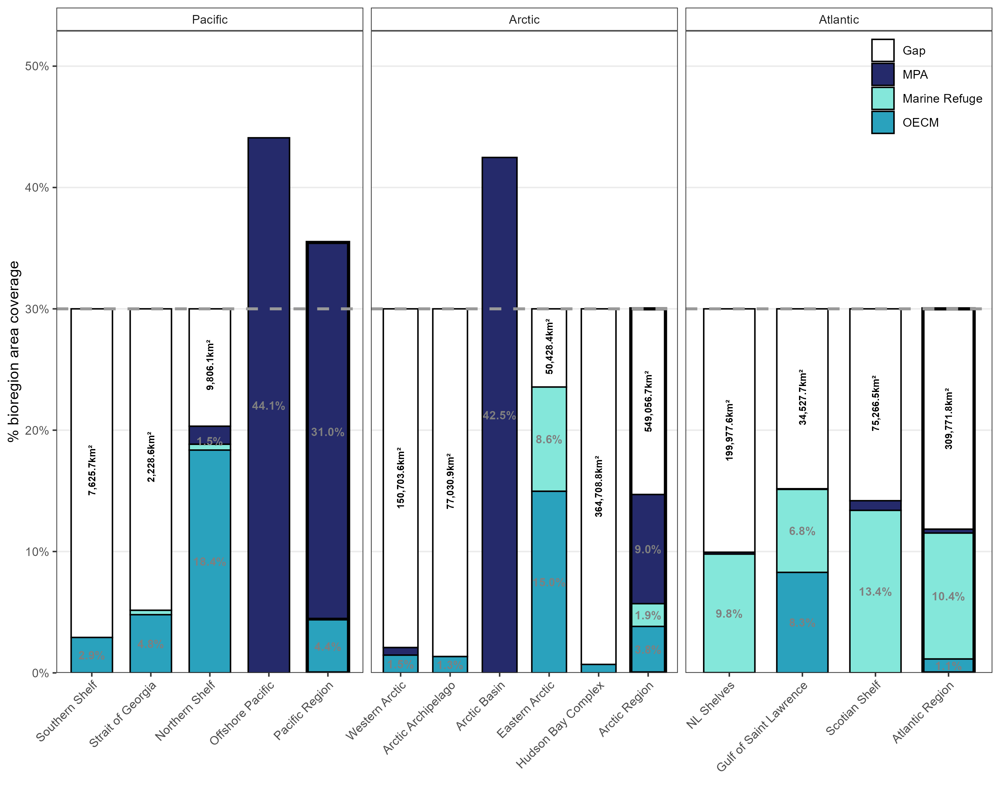
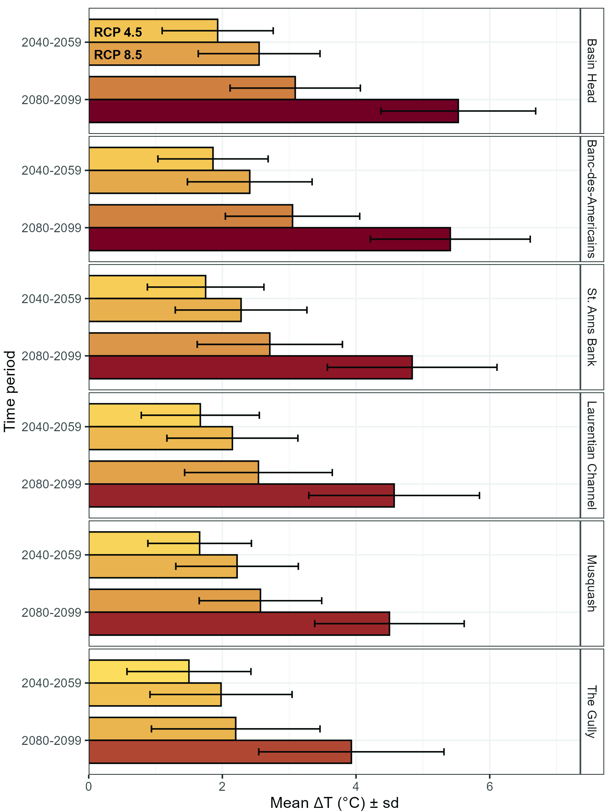

# Managing for long-term resilience in the Canadian Marine Conservation Network

***Abstract***

Biodiversity loss and climate change are closely linked threats to marine ecosystems, and marine conservation areas (MCAs) are widely promoted as key tools to address both. Canada has established a substantial network of MCAs, now covering over 15% of its marine estate, with a target of 30% by 2030 under the Global Biodiversity Framework. At the halfway point toward this commitment, rapid climate-driven ecological change raises questions about the long-term efficacy of static conservation strategies. This paper focuses on two challenges: (1) ensuring conservation objectives remain robust as ecosystems shift, and (2) improving adaptive management at both site and network scales to maintain ecological coherence and biodiversity. We synthesize Canada’s marine-conservation work by reviewing progress on MPA planning and management, climate-focused studies, the objectives set for protected areas, and the integration of Indigenous perspectives and knowledge. We assess how well objectives anticipate ongoing shifts and climate-change impacts, finding that about 30% of protected areas have objectives vulnerable to climate change. Addressing these challenges offers an opportunity to advance climate-smart planning and strengthen adaptive management across Canada’s growing marine-conservation network, helping to build a more resilient and adaptive system, better aligning with global conservation goals.

**Keywords**: Marine Protected Areas, Climate Change, Resiliency, Adaptive Management, Conservation

_Figure 1_ The Canadian Marine Conservation Network, stratified by bioregion (top row) and by ocean region and conservation measure (bottom row). The top row illustrates the distribution of conservation areas within each bioregion, while the bottom row presents conservation measures organized by ocean region and management type. Polygons obtained from the Canadian Protected and Conserved Areas Database in spring 2025. 

_Figure 2_ Percent coverage of conservation measures across different management types, stratified by bioregion and grouped by ocean region. The conservation ‘gap’ represented as the area require to achieve the GBF 30% target in each bioregion. Totals derived from the [Canadian Protected and Conserved Areas Database](https://www.canada.ca/en/environment-climate-change/services/national-wildlife-areas/protected-conserved-areas-database.html) Spring 2025.  

_Figure 3_ Projected changes in sea surface temperature in MPAs in the Gulf of St. Lawrence and Scotian Shelf Bioregions. Bars denote mean difference for 20 year periods relative to an average baseline value calculated using the GLORYS12 1993-2014 average. Standard deviation calculated using average of 22 CMIP6 models [(McKee et al. 2025)](https://publications.gc.ca/collections/collection_2025/mpo-dfo/Fs97-18-406-eng.pdf). Bars presented in groups for each time period and MPA with RCP 4.5 and 8.5 emission scenarios denoted by top and bottom bars, respectively. 

_Figure 4_ [Scotian Shelf-Bay of Fundy Draft Conservation Network](https://www.dfo-mpo.gc.ca/oceans/networks-reseaux/scotian-shelf-plateau-neo-ecossais-bay-baie-fundy/sites-eng.html) depicting existing Marine Protected Areas (MPAs), Marine Refuges (MRs), Other Effective Conservation Measures (OECMs) and draft network sites selected to meet regional conservation priorities (King et al. 2021). Also depicted MPAs in adjacent bioregions. 

